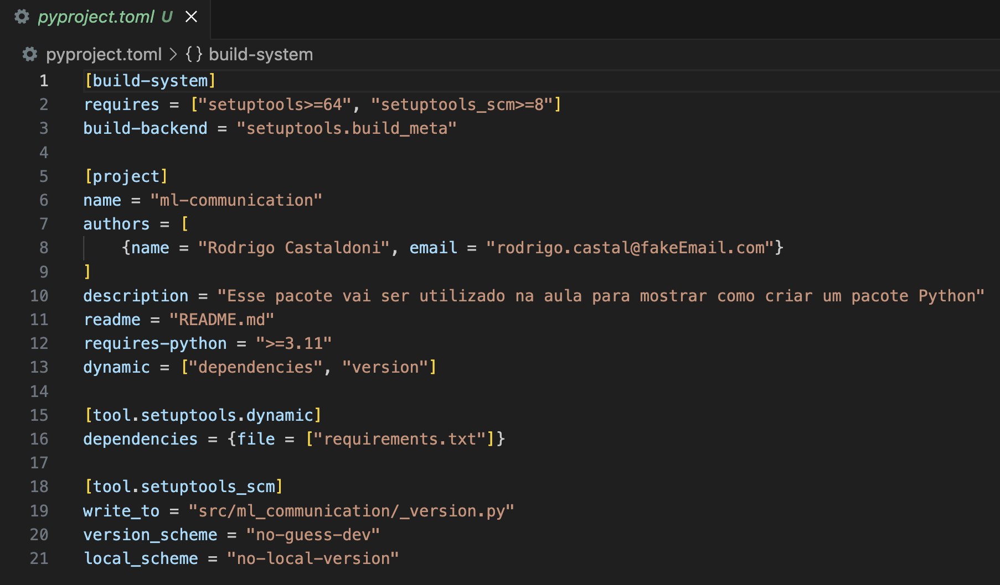
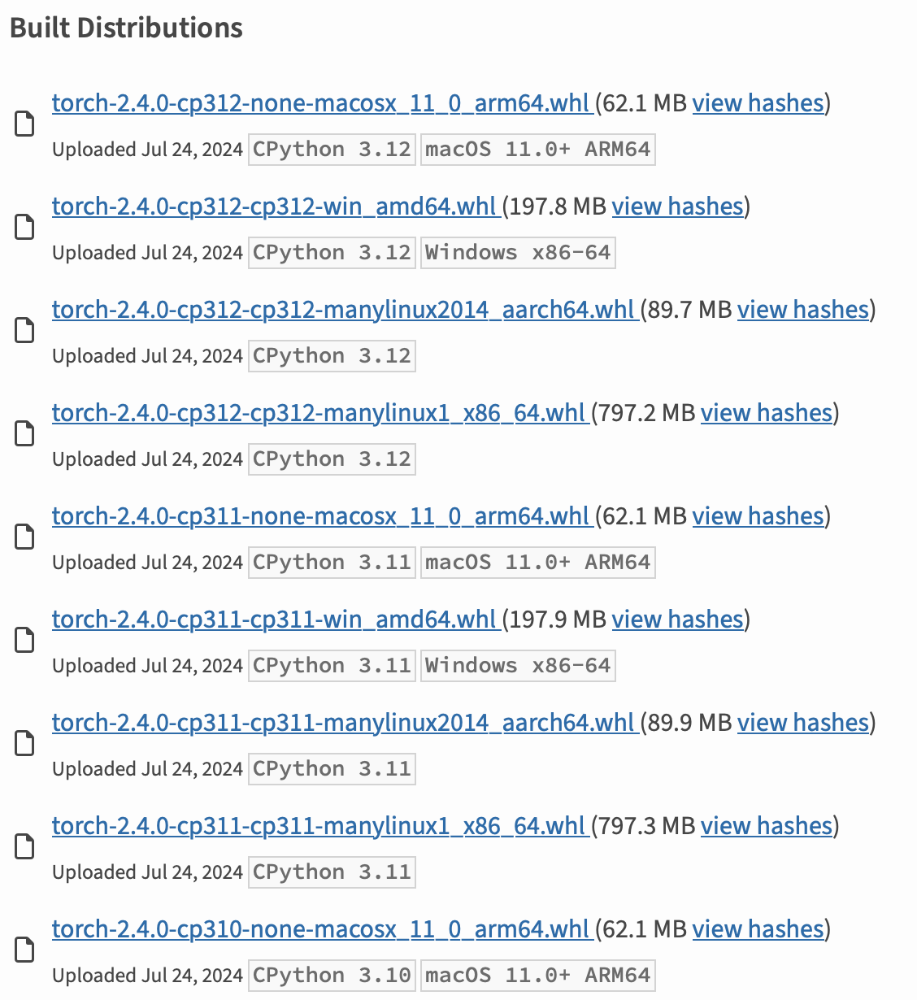

# Aula 5 - Pacotes


## Setup

Visando evitar conflitos  entre dependencias de outros projetos python vamos criar um ambiente virtual. Uma das forma de fazer isso é utilizando o seguinte comando:

```bash
python -m venv <env_name>
```

Para entrar no ambiente virtual voce pode utilizar o comando (Mac ou Linux): 

```bash
source <env_name>/bin/activate
```

## Pyproject File

A partir da PEP 621 a comunidade Python estabeleceu o uso do arquivo pyproject.toml como o jeito padrão de especificar metadados de um projeto. O arquivo [pyproject.toml](src/pyproject.toml) é separado por seções, denominadas tabelas (**[build-system]** e **[project]**).

A tabela **[build-system]** é utilizada para declarar qual *backend* (ferramenta) de construção vai ser utilizado para construir o pacote (nessa aula vamos utilizar o **setuptools** que normalmente ja vem instalado nos ambientes virtuias). Além disso, você também pode passar dependências específicas para construção do seu pacote.

A tabela [project] é o formato que a maioria dos *backends* de construção utiliza para especificar os metadados básicos do seu projeto, por exemplo: nome, autores, dependências, entre outros.

Além disso, também existe uma tabela específica denominada [tool], que possui sub-tabelas específicas para cada ferramenta, por exemplo [tool.bandit], [tool.ruff], [tool.pytest.ini_options], entre outros.

Exemplo de configuração:

<center></center>


## Desenvolvendo o pacote

Colocar na raiz do repositório o folder ```src``` e dentro o folder com o seu pacote (no nosso caso ```ml_communication```) é um padrão utilizado na industria.

Perceba que o nome do folder do seu pacote representa a forma como voce vai importar ele:, no nosso caso:

```python
import ml_communication
```

Durante a fase de desenvolvimento do seu pacote instale ele no modo editável (voce precisa estar no mesmo folder do arquivo ```pyproject.toml```):
```bash
pip install -e .
```

Caso voce nao esteja no folder correto voce vai receber um erro parecido com esse:
```bash
ERROR: file:///<path> does not appear to be a Python project: neither 'setup.py' nor 'pyproject.toml' found.
```

Quando voce instala dessa forma toda alteração feita é refletida de forma automática e voce não precisa fazer o build do pacote para testar as modificações.

## Gerando pacote de distribuição

Instalar o pacote para fazer o *build*:
```bash
pip install -U build
```

Executar o build:
```
python -m build
```

Sera gerado um folder ```dist``` com:
- Um arquivo ```.whl```: Representa a distribuição com build ja realizado.
- Um arquivo ```.tar.gz```: Representa o código fonte, de forma que o usuário posso fazer o build manualmente após download.

Essa diferença acontece pois pode ser que o pacote utilize algo especifico do sistema operacional onde a dependencia vai ser executada. Por exemplo, a biblioteca do pytorch tem vários whl a depender do sistema operacional onde vai ser utilizado:

<center></center>

## Fazendo o upload do pacote

Nesta aula vamos fazer o upload do nosso pacote no index de Test do PyPI, denominado PyPI (instância separada do índice de pacotes destinada a testes e experimentação). Vamos fazer os seguintes passos agora:
- Criei uma conta no TestPyPI nesse [link](https://test.pypi.org/account/register/).
- Verifique seu endereço de email.
- Ative o MFA (Multi Factor Authentication) da sua conta.
- Crie um token de API do PyPI, definindo o escopo para a conta inteira no [link](https://test.pypi.org/manage/account/#api-tokens).
- Adicione no path ```$HOME/.pypirc``` o seguinte conteudo:
```bash
[testpypi]
username = __token__
password = <TestPyPI API Token>
```

- Instale o pacote para fazer o *publish*:
```bash
pip install -U twine
```

- Cheque se sua distribuição é valida (Esse comando reportará problemas se não conseguir rendenizar o [README.md](src/README.md)):
```bash
twine check dist/*
```

- Faça o upload do pacote de distribuição no indice de test:
```bash
python -m twine upload --repository testpypi dist/*
```

## Baixando o pacote

Como estamos subimos um pacote no index de teste nao podemos utilizar o index *default*. Vamos indicar via parametro ```--index-url``` qual *url* utilizar:
```bash
pip install --index-url https://test.pypi.org/simple/ <package-name>
```

No exemplo dessa aula:
```bash
pip install --index-url https://test.pypi.org/simple/ ml-communication
```

# Versionamento

Links interessantes:
> https://github.com/c4urself/bump2version/blob/master/RELATED.md

Git suporta dois tipos de tags: ```lightweight``` e ```annotated```.

Uma tag leve é muito parecida com um branch que não muda — é apenas um ponteiro para um commit específico.

Tags anotadas, no entanto, são armazenadas como objetos completos no banco de dados do Git.

```bash
git tag -a <version> -m <message>
```

```bash
python3 -m pip install --index-url https://test.pypi.org/simple/
```